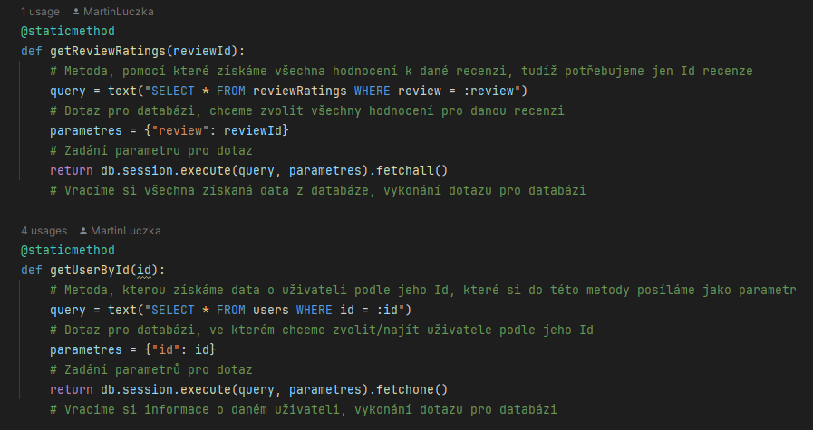
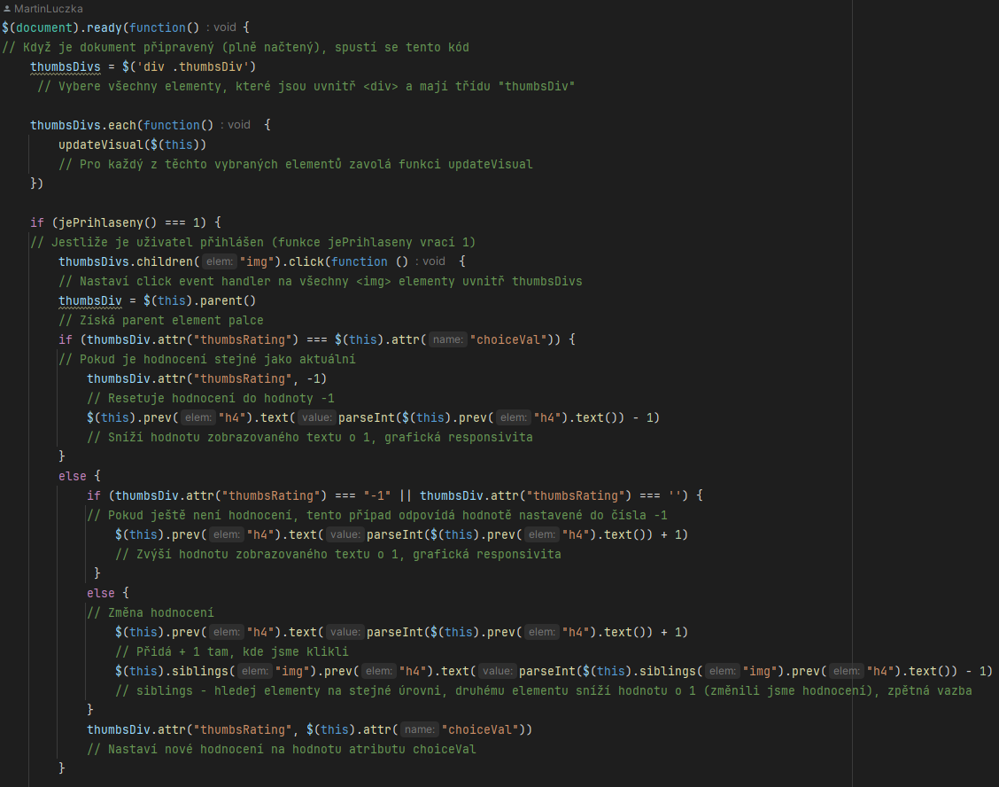
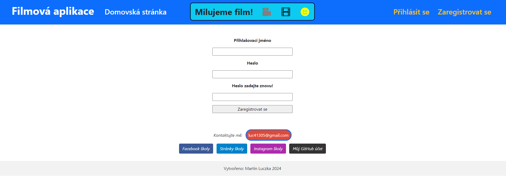
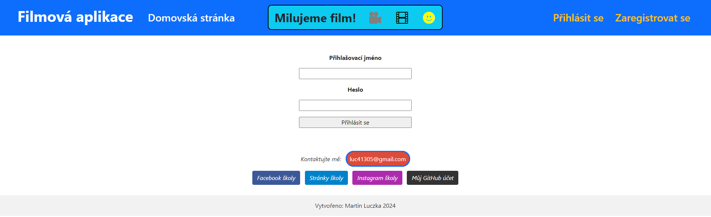
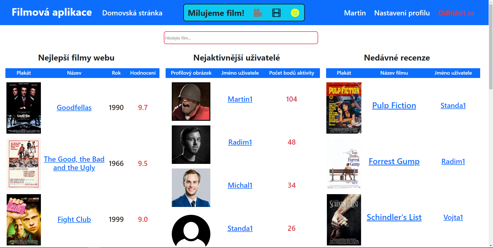
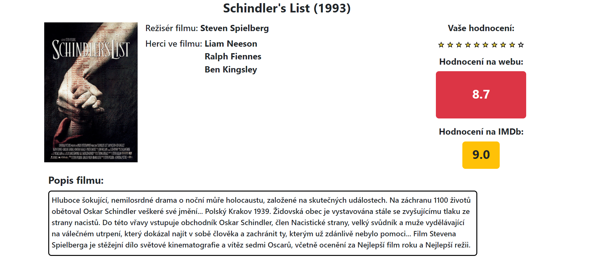
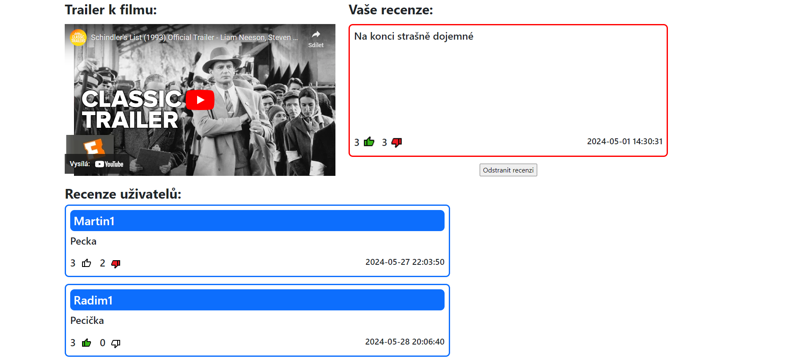
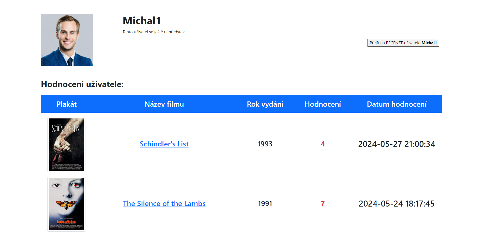
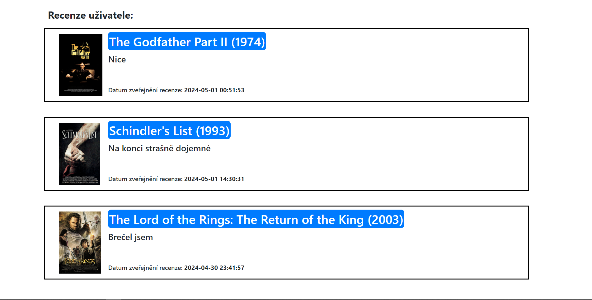
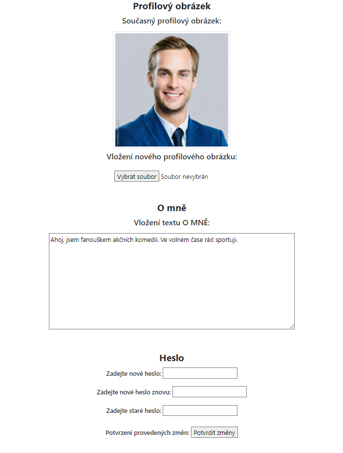

# MOVIE APP

## Jak si webovou aplikaci zprovoznit na svém zařízení ?

Aby web fungoval všem pouze s přístupem na internet, tak bych musel zařídit
nějaký hosting této webové aplikace. Pro účely našeho projektu je to ale
zbytečné. Nic ovšem nebrání tomu, abyste si mohli aplikaci zprovoznit
**lokálně** a na mnou vytvořený web se podívali a vyzkoušeli si ho.

**Po zprovoznění stačí následnovat pouze tyto pokyny:**

1. ### Pro zprovoznění webové aplikace musíte mít nainstalovaný Python (<u>**3.12 a novější**</u>)

Pokud nemáte, tak stiskněte `Win + X` a otevřte si Windows Powershell jako správce

Abyste jeho instalaci nemuseli pracně instalovat, tak si ho nainstalujeme pomocí <a href="https://chytrosti.marrek.cz/chocolatey.html">Chocolatey</a>.

Do Powershellu zadejte:

```
    Set-ExecutionPolicy Bypass -Scope Process -Force; [System.Net.ServicePointManager]::SecurityProtocol = [System.Net.ServicePointManager]::SecurityProtocol -bor 3072; iex ((New-Object System.Net.WebClient).DownloadString('https://community.chocolatey.org/install.ps1'))
```

Poté nainstalujte jednoduchým příkazem:

```
    choco install python
```

2. ### Stáhněte si tento projekt jako RAR (nebo si **naklonujte git repozitář**)

Pokud máte nainstalované nějaké vývojové prostředí př. **Visual Studio Code**, **VSCodium**, **Pycharm**...,
tak si složku projektu otevřít tam (**spusťte si konzoli**)

Pokud nic takového nemáte, nevadí. Otevřte si cestu do složky v **příkazovém řádku - cmd**

Jak se to dělá: <a href="https://www.youtube.com/watch?v=bgSSJQolR0E&t=47s">Otevření cmd z Průzkumníka souborů</a>

3. ### Teď už jen stačí nainstalovat knihovny, které webová aplikace využívá

**Tyto příkazy POSTUPNĚ vkládejte a vykonávejte ve vašich terminálech**

(***pip*** je součástí **Pythonu**)

```
  pip install flask
```

```
  pip install SQLAlchemy
```

```
  pip install Flask-SQLAlchemy
```

*Poznámka: SQLAlchemy by měla být součástí knihovny Flask-SQLAlchemy, ale
v projektu importujeme z obou, tak si ji (i pro klid v duši) nainstalujte.
Děkuji.*

> [!CAUTION]
> Pokud Vám knihovny v aplikaci VS Code nefungují po nainstalování, tak ho zkuste zapnout a vypnout.
> Samotný jsem to zkoušel zprovozňovat na jiném zařízením a tam to zabralo.
> 
> Jinak si **NEZAPOMEŇTE ZKONTROLOVAL VERZI PYTHONU**. V části kódu syntakticky fungují
> jen verze **3.12 a novější**.

4. ### Dále už jen Flask aplikaci spustíte a můžete se s mojí stránkou seznámit

**Pokud máte adresář příkazového řádku ve složce projektu tak už stačí jen zadat tento příkaz**:

```
  C:\cesta adresáře> python -m flask run
```

*Poznámka: disk C je pouze příklad, Vy to můžete mít jinak.*

5. ### Poté jen zadejte do webového prohlížeče adresu lokálního portu

Ve Vašem případě bude s největší pravděpodobností adresa portu vypadat takto: **127.0.0.1:5000**

6. ### Webová aplikace by měla být funkční a vy ji můžete v klidu vyzkoušet

**S případnými problémy se mě nebojte kontaktovat, viz konec README**.

> [!NOTE]
> Nespouštějte jen tak Python soubory ve složce ***insertovac***, tu jsem přidal
> teď na konec mezi posledními commity, aby lidé, které to zajímá, se mohli
> podívat, jak jsem řešil přidávání dat do databáze. Tyto soubory nejsou
> nějak extra okomentovány. Spuštění souborů by začlo přímo upravovat
> databázi !

## Jak vznikl tento projekt ?

Projekt byl vytvořen jako závěrečná práce do předmětu 
**Programování ve 3. ročníku** na 
<a href = "https://www.spseol.cz/">SPŠEOL</a>. 
Zadáním bylo si v libovolném programovacím jazyce zpracovat projekt. 
To, o čem projekt měl být, jsme si mohli vybrat sami. 
Měl jsem více nápadů, ale volba padla na **Webovou aplikaci vytvořenou pomocí webového frameworku Flask a databázovým systémem SQLite**.

<table>
  <tr>
    <td>
      
    </td>
    <td>
      
    </td>
  </tr>
</table>

## Proč zrovna webová aplikace zaměřená na hodnocení filmů ?

Již od malička jsem měl rád filmy a čím víc přibývalo těch, 
které jsem již viděl, tím víc se mi zamlouvala myšlenka, 
že by člověk všechny filmy, které viděl, měl na jednom místě. 
A ještě k tomu ohodnocené či okomentované ! 
Vždy se mi tím pádem líbily stránky jako 
<a href = "https://www.csfd.cz/">ČSFD</a> 
či zahraniční <a href = "https://www.imdb.com/">IMDb</a> a samozřejmě další. 
Tyto stránky na tomto projekty zanechaly také svůj otisk, 
ale snažil jsem se v několika věcech aspoň mírně odlišit. 
To, jak se mi to povedlo, zhodnotíte už Vy. 
Něco podobného jsem už řešil v rámci programu napsaného čistě v Pythonu (odkaz: <a href="https://github.com/MartinLuczka/MOVIE-APP">Stará Movie App</a>), 
ale tady je to samozřejmě posunuto na mnohem vyšší úroveň.

> [!TIP]
> Pokud by Vás mimochodem zajímalo něco na způsobem mé stránky, ale co se týče videoher, tak určitě můžu doporučit stránku <a href="https://www.backloggd.com/">Backloggd</a>, na které jsem si sám před nedávnem založil účet.

## Jak jsem projekt vytváře, jak jsem postupoval, v jakém vývojovém prostředí jsem pracoval ?

Projekt jsem si rozdělil na dvě části. 
**Funkční stránka projektu** představovala práci s Flaskem a vytváření metod pro práci s databází.
V této části jsem si také musel udělat HTML stránky, 
ale používal jsem pouze základní elementy a všechno jsem dával pod sebe.
Do této části také samozřejmě spadají také funkční JavaScript soubory, 
se kterými jsem ale popravdě bojoval až do dokončení projektu.

<br>**Stylování vytvořených HTML stránek**
byla řekněmě druhá část projektu. Ve spojitosti tady s tímto mě napadlo si
vyzkoušet nějaký framework, podle kterého bych své webové stránky nastyloval.
Po chvíli hledání mých možností padla volba na **CSS framework** 
<a href = "https://getbootstrap.com/">**Bootstrap**</a>, se kterým jsem se po
pár tutoriál videích seznámil dostatečně na to, abych s ním mohl pracovat.
V práci mi také pomohla velice názorná a příklady proložená 
<a href = "https://getbootstrap.com/docs/3.4/css/">Dokumentace</a> (starší verze, ale 
vše je pěkně pohromadě). Při stylování jsem si přidáváním některých
prvků rozházel funkčnost některých prvků, ale vše jsem nakonec vyřešil a opravil.

<br>Projekt jsem začal vytvářet ve vývojovém prostředí programu **Visual Studio Code**,
avšak s vidinou šikovnější práce s databází a jednotlivými tabulkami jsem
přešel na vývojové prostředí programu <a href = "https://www.jetbrains.com/pycharm/">**PyCharm**</a>,
se kterým jsem byl po dobu celé své práce naprosto spokojen.
Nejdřív jsem zaregistroval pouze program <a href="https://www.jetbrains.com/datagrip/?var=light">Datagrip<a/>,
ale ten je do PyCharmu v podstatě integrován. 
Oba programy totiž spadají pod (dokonce českou) softwarovou společenost
<a href = "https://www.jetbrains.com/">**JetBrains**</a>,
která podobných programů provozuje celou řadu.

<table>
  <tr>
    <td>
      
    </td>
    <td>
      
    </td>
    <td>
      
    </td>
  </tr>
</table>

> [!TIP]
> Pokud jste studentem a máte **ISIC kartu**, tak si můžete v rámci produktů
> společnosti **JetBrains** aktivovat studentské license, které jsou tak pro
> vás přístupné **zadarmo**.

## Jak jsem si vytvořil databázi tolika filmů ?

Databáze je tvořena **TOP 250 filmy**, které jsem si pomocí Python skriptů
vytáhl ze stránek <a href = "https://www.imdb.com/">IMDb</a>. Tyto Python soubory se nachází ve složce
*insertovac*, kterou jsem skrze celý projekt necommitoval, ale
zahrnu ji v rámci posledních commitů k tomuto projektu.
Tímto jsme tedy získaly všechny důležitá data k filmu.

Byly tu ovšem určité problémy, které jsem vyřešil přidáním dalších 
Python souborů, v našem případě dvěma dalšími. Odkazy na
trailery fungovaly vždy jen chvíli, tak jsem si do databáze nechal
poslat odkazy na youtube videa (Python vyhledá název filmu + trailer
na stránce <a href = "https://www.youtube.com/">Youtube</a>) a Python
program již vezme a do databáze uloží adresu prvního výsledku).  

Dále byl problém s popisem filmů v angličtině. Ten jsem vyřešil tak, 
že si na stránkách <a href = "https://www.csfd.cz/">ČSFD</a> vyhledávám
jednotlivé filmy a vybírám si text z popisu filmu u prvního výsledku.
Jelikož jsou to většinou ty nejznámnější filmy, tak první výsledek je
ve všech případech s největší pravděpodobností dobře (nenarazil jsem na chybu).
Filmy, u kterých chyběl popisek (nebyl nebo se nevyhledal celý název filmu, ČSFD
má omezený počet znaků ve vyhledávání na 50 - vyhodí tím pádem chybu), tak
jsem popisky doplnit manuálně za pomoci internetu.

## Python souborů je v projektu strašně moc a některé jsou dost rozsáhlé, jak se v tom mám vyznat ?

Nebojte, myslel jsem na Vás (ale také trochu na sebe). Jelikož jsem nic
podobného nikdy nedělal, tak jsem si chtěl v kódu udržovat nějaký pořádek
a přehled. Protože jsem se chtěl koncepty **hlavně naučit**, tak v **Pythonu**
a **JavaScriptu** jsou (skoro) všechny řádky zakomentovány. Některé komentáře
se tam trochu zbytečně opakují několikrát, ale pokud by někdo přeskakoval,
tak jsem to tak raději nechal. V **HTML** jsem kód v podstatě moc nekomentoval,
nemyslím si, že by to přineslo moc užitku a já osobně se v tom lépe vyznám
spíše takto.

**Ukázka:**

***Python***
<br>


***JavaScript***
<br>


## Jak to celé funguje ?

### **Python soubory** ve složce ***dbModels***

Tyto Python skripty zavádí tabulky v databázích, můžete si z nich vyčíst, co
vše se do tabulek ukládá, jaká data představují jaký datový typ, nebo se můžete
podívat jaké údaje můžou být nenulové či nikoliv.

**Databáze** je určitě jeden z nejzákladnějších kamenů této aplikace a bez
něj by to nešlo.

### Složka ***pyFiles***

#### dbWrapper.py

Tento soubor obsahuje třídu Dbwrapper, která obsahuje nespočet metod, které
získávají (třeba na vypsání něčeho na HTML stránku), upravují, mažou či 
vytvářejí data databáze **database.db**. Tyto funkce voláme zpravidla z hlavního
souboru **app.py** buď právě při načtení HTML stránky, nebo při splnění 
určitých podmínek (uživatel okomentoval, ohodnotil, přidal popisek na svém
profilu atd.)

#### Encoder.py

Zajišťuje funkci, které změní zadané heslo uživatele při přihlášení na
zakódovanou směs číslic a písmen. Je to hashovací algoritmus 
**SHA256 (Secure Hash Algorithm)**. Tímto způsobem nezná uživatelovo
heslo nikdo jiný, než sám uživatel. V databázi je heslo zakódované.

#### GetData.py

Není moc používaný, protože jsem postupně přišel na jiný způsob získávání dat
z toho, co posílá databáze. I tak je ale na pár místech použit a funguje dobře
a spolehlivě.

#### UserController.py

Funkce, které řeší přihlášení a odhlášení. V podstatě by mohly být součástí
třídy Dbwrapper, ale vytvořil jsem je takto jako funkce do samostatného
Python souboru. Jsou to ale také nějaké dotazi a pokyny pro databázi.
Při **registraci** je to samozřejmě vytvoření nového záznamu. A při
**přihlášení** se řeší shoda s již danými údaji při registraci.

### Složka ***static***

#### Složka ***imgs***

Obsahuje obrázky spojené s aplikací. Jedná se o profilové obrázky
jednotlivých uživatelů a také samozřejmě obrázky, které využívá
**JavaScript** při zobrazování různých typů hodnocení.

#### Rating.js

**JavaScript, který řeší hodnocení filmu na stránce filmu** pomocí
hvězdiček. **Dokument sleduje pohyb myši** a "rozsvěcuje" a "zhasíná" udávané
hvězdičky. Při stisknutí zjistí, na jaké hvězdě bylo kliknutí provedeno
a **pošle data na url adresu**, kterou dále řešíme v **app.py** (data poté
posíláme do databáze).

Tenhle i ostatní **JavaScripty** jsou psány pomocí **knihovny <a href="https://cs.wikipedia.org/wiki/JQuery">jquery</a>**.

#### ReviewRating.js

**JavaScript soubor, který zajišťuje hodnocení recenzí** pomocí palce
nahoru a palce dolů. Sleduje, jestli je uživatel přihlášen a pokud ano, tak
si hlídá, jestli někdo palec nahoru nezmáčknul. Pokud ano, tak zjistí jaký
a hlavně u jaké recenze. Tyto data opět posíláme do **app.py**, které jej poté
dále zpracovává a posílá na databázi, respektive opět nějaká Dbwrapper
metoda, která dané informace musí převzat jako parametry. Vybarvené či
nevybarvené palce nahoru zobrazuje podle proměnné **thumbsRating**, která
se nastavuje již v **app.py** a je dána daty z databáze. Proměnná je to 
až v JS, v app.py je to klíč slovníku **review** s názem
***logedinUsersReviewRating***.

#### SearchBar.js

**JavaScript soubor, který zajišťuje fungování vyhledávače filmů**. SearchBar
je vlastně input, který se pořád kouká jestli to něj někdo něco zrovna zadává.
Jestli do něj někdo něco zadá, tak tuto hodnotu posílá přes route do funkce, 
který získá odpovídající filmy z databáze. Tyto data posílá zpátky do JavaScriptu,
která z nich dělá za pomocí funkce **dataToList** dělá nečíslovaný seznam,
který se zobrazuje v HTML.

### Složka ***Templates***

V této složce se nachází všechny HTML soubory. Ve složce ***reusable*** jsou HTML
soubory, které používáme na každé jiné HTML stránce (máme je tam zahrnuté (**include**)).
Tímto způsobem je tam nemusíme psát pořád od znovu a ušetříme místo a soubor je
tím pádem přehlednější.

HTML soubory přímo ve složce ***templates*** jsou unikátní a uživatel si je
může zobrazit buď přes hlavní nabídku v navigátoru stránky, či skrze různé
prokliky přes domovskou stránku a stránku filmu.

### Python soubor **app.py**

To nejdůležitější na konec. Tento soubor je v podstatě **srdcem celé Flask
webové aplikace**. Pokud se dostanete na webovkách na nějakou cestu, tzv. **route**,
tak to tento Python soubor pozná a **spustí vždy nějakou funkci**, která
požadavek nějakým způsobem **obslouží**. Na stránce filmu route například předá
do funkce id filmu a samotná funkce už si s touto znalostí vytahuje jednotlivé
data **pomocí metod Dbwrapperu z databáze**. Ale zase některé routy mají mnohem
"akčnější" funkci a přebírají různá data a třeba mažou nebo přidávají recenze
v databázi. Dalo by se říct, že je takovým "**zprostředkovatelem
komunikace mezi databází a HTML stránkami**".

## Lehký popis obsahu na jednotlivých HTML stránkách

### Stránka registrace

Uživatel zadává své přihlašovací jméno (**nejde posléze změnit, slouží poté jako nick na stránce**)
a také své heslo, které musí pro potvrzení zadat znovu stejně jako předtím.

Stránka také vyhazuje zprávu když se zadaná hesla liší, nebo když je 
uživatelské jméno již zabrané.



### Stránka přihlášení

Dosti podobná té na registraci. Zde je jen zadání přihlašovacího jméno a 
potvrzení přihlášení helsem.

Opět zobrazujeme chybové hlášky: např. **Chybné heslo nebo přihlašovací jméno**.



### Domovská stránka

**Je rozdělena na 3 sloupce, každý sloupec informuje o něčem jiném**.

**První sloupec nám zobrazuje TOP 10 nejlepších filmů** naší webové stránky.
Seřazuje je podle hodnocení. Zobrazujeme ještě plakát, název a rok vydání.
Na stránku filmu jde samozřejmě prokliknout.

**Druhý sloupec nám zobrazuje TOP 10 nejvíce aktivních uživatelů**. O nich
nám zobrazujeme profilový obrázek, jméno a počet bodů aktivity, které mají.
Podle těchto bodů jsou sloupce seřazeny. Profil uživatele si můžeme rozkliknout.
Body jsou dány takto:
- **8** bodů za recenzi filmu
- **3** body za ohodnocení filmu
- **1** bod za ohodnocení cizí recenze

**Třetí sloupec zobrazuje TOP 10 nedávných recenzí**. Recenze jsou zde seřazeny
podle datumu přidání recenze. Nejnovější je vždy nahoře. Zde zobrazujeme plakát
a název filmu. **Pokud si film rozklikneme, tak nás automaticky přesměruje
na místo dané recenze na stránce**. Můžeme si samozřejmě rozkliknout i profil
uživatele.



### Stránka filmu

Stránka filmu nám shrnuje základní informace o daném filmu. Máme zde také možnost
ho ohodnotit a naše hodnocení graficky vidět. Pokud film ještě není ohodnocen,
tak je u hodnocení napsáno: ***Nehodnoceno***. Dále pokud jsem přihlášení, tak
můžeme vidět možnost pro napsání recenze, popřípadě pokud již recenzi máme, tak ji
můžeme smazat. Zároveň také vidíme počet liků a disliků na naší recenzi.

**Jen pokud nějaké jsou**, tak se nám zobrazují recenze ostatních uživatelů,
které můžeme ohodnoit, pokud jsme přihlášeni. Zobrazuje se také počet liků a
disliků jednotlivých recenzí. Přes recenzi můžeme rozkliknout profil daného
uživatele.

Na stránce se také nachází **trailer na film**, ten většinou může být
spuštěn rovnou ze stránky, někdy je k dispozici **pouze odkaz na stránky
youtube**.




### Stránka uživatele

Na stránce uživatele můžeme vidět jeho profilovou fotku (kterou si buď sám
vybere nebo dostane defaultní při registraci), popisek (ten si může průbězně
kdykoliv měnit, upravovat, mazat, je to jen na něj).

Dále se můžeme kouknout na uživatelovi **hodnocení a recenze**. Pokud uživatel
nemá žádnou recenzi, nebo nemá žádné hodnocení, tak se dané tabulky nezobrazují, 
takže se nemůže stát, že by zůstal pouze nadpis tabulky bez obsahu.

V tabulce s hodnocením **zvýrazňujeme především hodnocení**, ale také zde
máme mnoho základních informací o filmu a také datum hodnocení.

Recenze jsou graficky spíše takové **"kartičky"**, ve kterých máme název filmu s 
jeho plakátem + samozřejmě obsah recenze a datum odeslání napsané recenze.

Na začátku stránky máme tlačítko, **které nás na stránce přesune rovnou na recenze**.
To se může hodit v případě, když uživatel má mnoho hodnocení a my se nechceme
uscroolovat.




### Stránka nastavení profilu uživatele

Tato stránka je **kompozičně zpracována na prostředek**, stejně jako stránka přihlášení
a odhlášení. Volil jsem to proto, že když má stránka méně obsahu, tak se mi
to více líbí takhle na prostředku, ale to je zase dost subjektivní záležitost.

Na této stránce si můžeme **vybrat profilovou fotografii ze svého počítače**, musí to
být obrázek, který se poté převede na `.png` soubor. Tyto obrázky se poté
ukládají pod číslem ***(id)*** daného uživatele. Obrázek poté můžeme samozřejmě
kdykoliv změnit.

Dále si můžeme **upravit, smazat, napsat nanovo text, který nás na našem profilu
představuje ostatním**. Toto pole může být také úplně prázdné, ale potom máte na
profilu napsáno, že jste se ještě nepředstavili...

Poslední tu máme **změnu hesla**, při které musíme **zadat heslo nové správně 2x** a poté ještě
**zadat heslo "staré"**. V rámci zadávání je několik "chybových hlášek", které
mohou nastat. Např. **"Špatně zadané staré heslo"** či **"Nová hesla se neshodují"** a další.

Tyto změny poté můžeme všechny naráz **poslat potvrzením změn tlačítkem**.
Profilový obrázek, popisek i nové heslo můžeme nastavit kliknutím na jedno
tlačítko. **Nemusíme posílat všechno zvlášť na několikrát**.



## Poděkování

Rád bych poděkoval svému učiteli do Programování **panu Krbcovi**, že ve mně svými
hodinami a stylem učení vyvolal chuť k programování a také za jeho rychlou
zpětnou vazbu, co se týče dotazů a připomínek. Dále bych chtěl také poděkovat
svému bratranci **Standovi**, který mi pomáhal s tvorbou JavaScriptu a také
mi vysvětloval některé principy pokročilejšího programování v Pythonu.

## Dojmy, nápady, návrhy

Tvorba této webové aplikace mi dala **spoustu nových znalostí** a přiměla mně se
koukat na programování zase trochu jiným pohledem. Chtěl jsem si vyzkoušet, co
je vše potřeba znát k vytvoření nějaké funkční aplikace a **tuto zkušenost se
mi podařilo získat**, za což jsem nesmírně rád.

Měsíc a půl jsem usilovně pracoval na **vytvoření funkční stránky, kterou
se budu moct být schopný prezentovat** a myslím si, že mi to vyšlo.
Stránka má vše, co jsem si původně "vysnil", že by mohla umět, to mě
velice těší.

V případě že byste narazili na chybu, něco Vám nešlo, chtěli byste se na vývoji aplikace 
nějak podílet, chtěli byste něco vědět, rádi byste zařídili hosting :), 
tak se mě nebojte kontaktovat na emailové adrese: ***luczka.martin@gmail.com***

**Martin Luczka**


